

# SE-Assignment-5
Installation and Navigation of Visual Studio Code (VS Code)
 Instructions:
Answer the following questions based on your understanding of the installation and navigation of Visual Studio Code (VS Code). Provide detailed explanations and examples where appropriate.

 Questions:

1. Installation of VS Code:
   - Describe the steps to download and install Visual Studio Code on Windows 11 operating system. Include any prerequisites that might be needed.
   
   1. Visit the Official Website of the Visual Studio Code using any web browser like Google Chrome, Microsoft Edge, etc. 
   2.	Press the “Download for Windows” button on the website to start the download of the Visual Studio Code Application.
   3.	When the download finishes, then the Visual Studio Code Icon appears in the downloads folder.
   4.	Click on the Installer icon to start the installation process of the Visual Studio Code.
   5.	 After the Installer opens, it will ask you to accept the terms and conditions of the Visual Studio Code. Click on I accept the agreement and then click the Next button.
   6.	Choose the location data for running the Visual Studio Code. It will then ask you to browse the location. Then click on the Next button.
   7.	Then it will ask to begin the installation setup. Click on the Install button.
   8.	After clicking on Install, it will take about 1 minute to install the Visual Studio Code on your device.
   9.	After the Installation setup for Visual Studio Code is finished, it will show a window like this below. Tick the “Launch Visual Studio Code” checkbox and then click Next.

2. First-time Setup:
   - After installing VS Code, what initial configurations and settings should be adjusted for an optimal coding environment? Mention any important settings or extensions.

   General Settings:
   Choosing a theme
   Selecting Font: Popular choices include Cascadia Code, Fira Code, and Consolas.
   Enabling Auto Save: Enable "Files: Auto Save" to automatically save your work, preventing accidental data loss.
   Installing extentions.

   Extensions:
   Languages - C++, C#, Go, Java, Python
   Tools - ESLint, JSHint , PowerShell
   Debuggers - PHP XDebug.
   Keymaps - Vim, Sublime Text, IntelliJ, Emacs, Atom, Brackets, Visual Studio, Eclipse

3. User Interface Overview:
   - Explain the main components of the VS Code user interface. Identify and describe the purpose of the Activity Bar, Side Bar, Editor Group, and Status Bar.

   Editor - The main area to edit your files. You can open as many editors as you like side by side vertically and horizontally.
   Side Bar - Contains different views like the Explorer to assist you while working on your project.
   Status Bar - Information about the opened project and the files you edit.
   Activity Bar - Located on the far left-hand side. Lets you switch between views and gives you additional context-specific indicators, like the number of outgoing changes when Git is enabled. You can change the position of the Activity Bar.

4. Command Palette:
   - What is the Command Palette in VS Code, and how can it be accessed? Provide examples of common tasks that can be performed using the Command Palette.

   Command Palette lets you quickly find and apply commands. To open the Command Palette, choose View > Command Palette or Ctrl–Shift–P (Windows).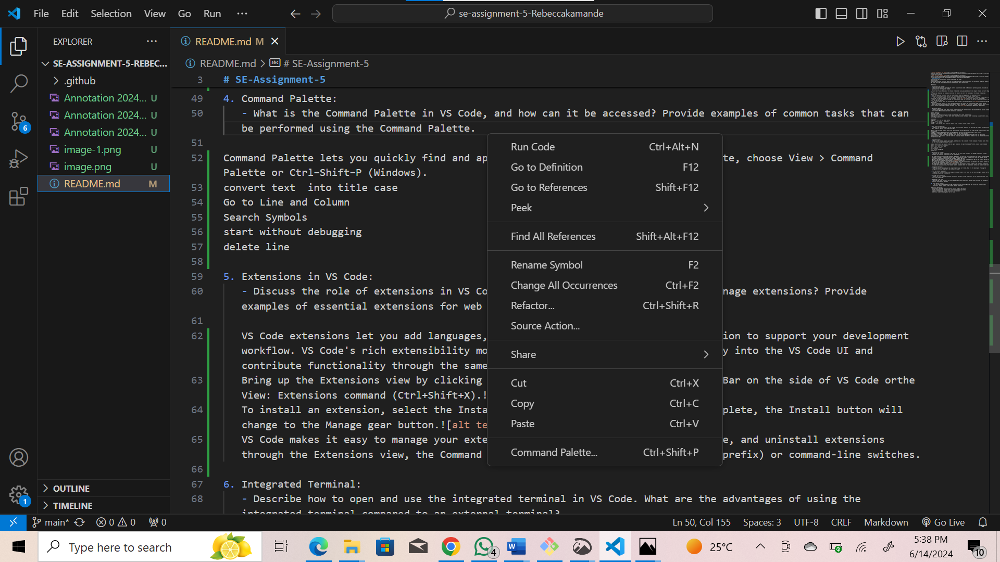
   converts text  into title case
   Go to Line and Column
   Search Symbols
   start without debugging 
   delete line

5. Extensions in VS Code:
   - Discuss the role of extensions in VS Code. How can users find, install, and manage extensions? Provide examples of essential extensions for web development.

   VS Code extensions let you add languages, debuggers, and tools to your installation to support your development workflow. VS Code's rich extensibility model lets extension authors plug directly into the VS Code UI and contribute functionality through the same APIs used by VS Code.
   Bring up the Extensions view by clicking on the Extensions icon in the Activity Bar on the side of VS Code orthe View: Extensions command (Ctrl+Shift+X).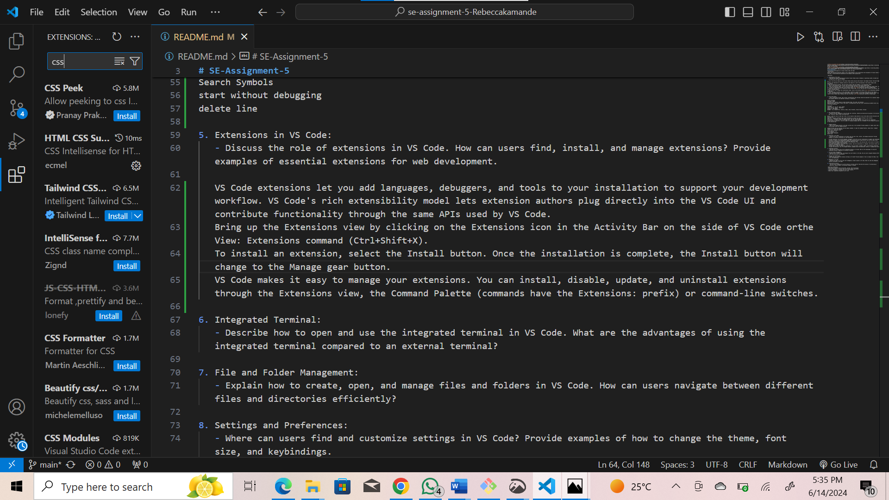
   To install an extension, select the Install button. Once the installation is complete, the Install button will change to the Manage gear button.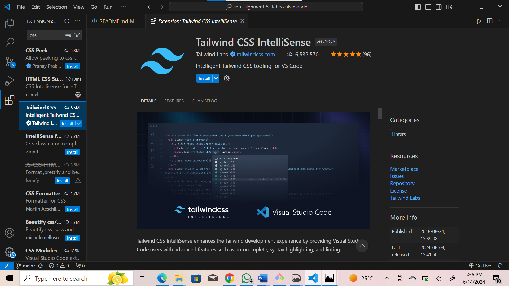
   VS Code makes it easy to manage your extensions. You can install, disable, update, and uninstall extensions through the Extensions view, the Command Palette (commands have the Extensions: prefix) or command-line switches.
   Extensions:
   Languages - C++, C#, Go, Java, Python
   Tools - ESLint, JSHint , PowerShell
   Debuggers - PHP XDebug.
   Keymaps - Vim, Sublime Text, IntelliJ, Emacs, Atom, Brackets, Visual Studio, Eclipse

6. Integrated Terminal:
   - Describe how to open and use the integrated terminal in VS Code. What are the advantages of using the integrated terminal compared to an external terminal?

  From the menu, use the Terminal > New Terminal or View > Terminal menu commands.
  From the Command Palette (Ctrl+Shift+P), use the View: Toggle Terminal command.
  In the Explorer, you can use the Open in Integrated Terminal context menu command to open a new terminal from a folder.
  To toggle the terminal panel, use the Ctrl+` keyboard shortcut.
  To create a new terminal, use the Ctrl+Shift+` keyboard shortcut.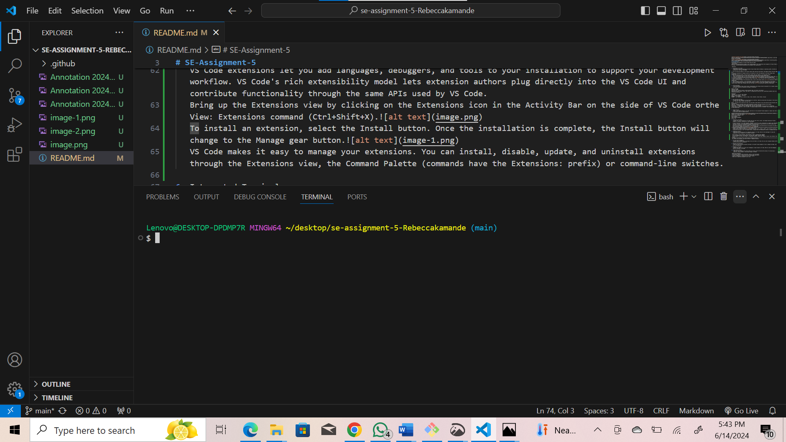
  Advantages of the Integrated Terminal
  Seamless Workflow: Switch between editing code and running commands in the terminal without leaving VS Code. This saves time and reduces context switching.
  Context Awareness: The integrated terminal inherits the working directory of your current workspace, eliminating the need to navigate to the correct folder manually.

7. File and Folder Management:
   - Explain how to create, open, and manage files and folders in VS Code. How can users navigate between different files and directories efficiently?

   Creating Files and Folders:
   Explorer:
   Right-click within the Explorer view (usually on the left side) and select New Folder or New File.
   Click the "+" icon in the top bar of the Explorer and choose the desired option.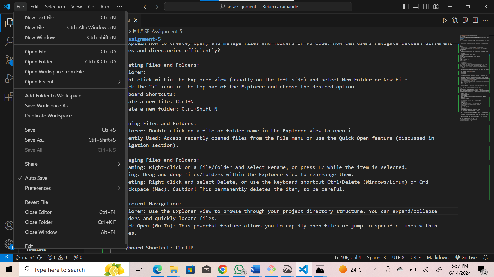
   Keyboard Shortcuts:
   Create a new file: Ctrl+N 
   Create a new folder: Ctrl+Shift+N 

   Opening Files and Folders:
   Explorer: Double-click on a file or folder name in the Explorer view to open it.
   Recently Used: Access recently opened files from the File menu or use the Quick Open feature.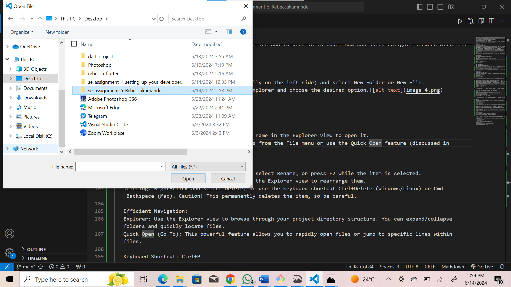
   Managing Files and Folders:
   Renaming: Right-click on a file/folder and select Rename, or press F2 while the item is selected.
   Moving: Drag and drop files/folders within the Explorer view to rearrange them.
   Deleting: Right-click and select Delete, or use the keyboard shortcut Ctrl+Delete (Windows/Linux) or Cmd+Backspace (Mac). Caution! This permanently deletes the item, so be careful.

   Efficient Navigation:
   Explorer: Use the Explorer view to browse through your project directory structure. You can expand/collapse folders and quickly locate files.
   Quick Open (Go To): This powerful feature allows you to rapidly open files or jump to specific lines within files.
   Keyboard Shortcut: Ctrl+P 
   Start typing the name of the file or symbol you want to access, and VS Code will provide filtered suggestions.
   File Switcher: Quickly switch between recently opened files using Ctrl+Tab 
   Breadcrumbs: The breadcrumbs bar at the top of the editor window indicates your current location within the project directory. Click on a folder name to navigate back to that level.

8. Settings and Preferences:
   - Where can users find and customize settings in VS Code? Provide examples of how to change the theme, font size, and keybindings.

   Theme:
   Select the File > Preferences > Theme > Color Theme menu item, or use the Preferences: Color Theme command (Ctrl+K Ctrl+T) to display the Color Theme picker.
   Use the Up and Down keys to navigate through the list and preview the colors of the theme.
   Select the theme you want and press Enter.

   Keybindings:
   File > Preferences > Keyboard Shortcuts or by using the Preferences: Open Keyboard Shortcuts command (Ctrl+K Ctrl+S).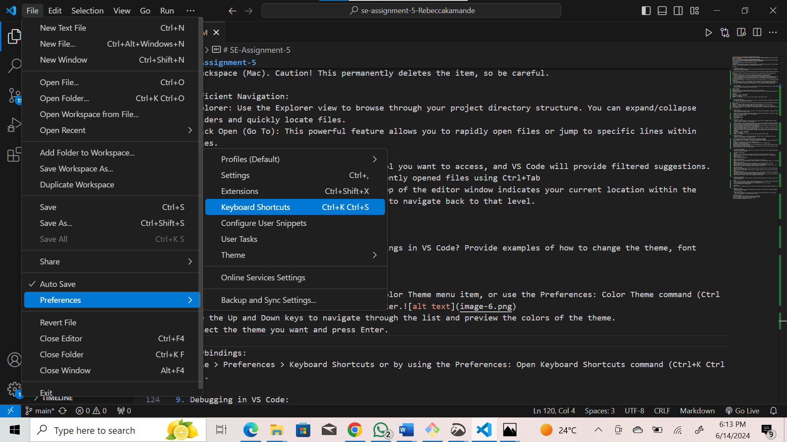

   Font size:
   File > Preferences > Settings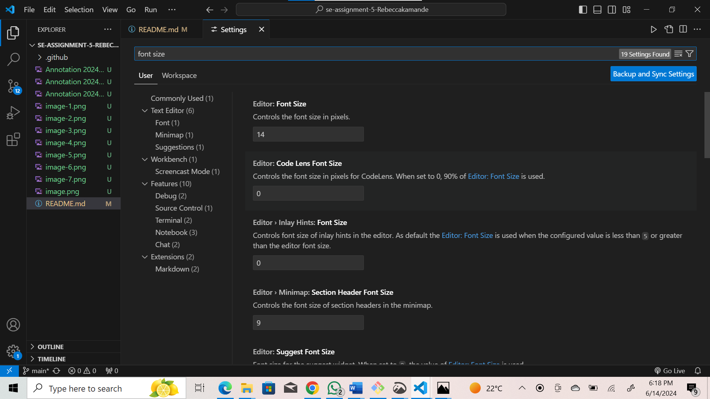
   Select the font size you prefer.

9. Debugging in VS Code:
   - Outline the steps to set up and start debugging a simple program in VS Code. What are some key debugging features available in VS Code?

   1. Prerequisites:

   Ensure you have the necessary language extension installed for your program's language (e.g., C++ extension for C++ code).
   Your program should be saved as a file within your project workspace.

   2. Create a launch.json file (Optional but Recommended):
   This file defines the configuration for your debugging session.
   VS Code might generate a basic launch.json upon first debug attempt. You can find it in the .vscode folder within your project directory.
   The launch.json file allows you to specify details like the program to debug, arguments to pass, and debugging environment.

   3. Set Breakpoints:
   These are lines of code where you want the program to pause execution during debugging.
   Click on the line number in the editor margin next to the line of code where you want to set a breakpoint. A red dot will appear.

   4. Start Debugging:
   Open the Run and Debug view (Ctrl+Shift+D or Cmd+Shift+D).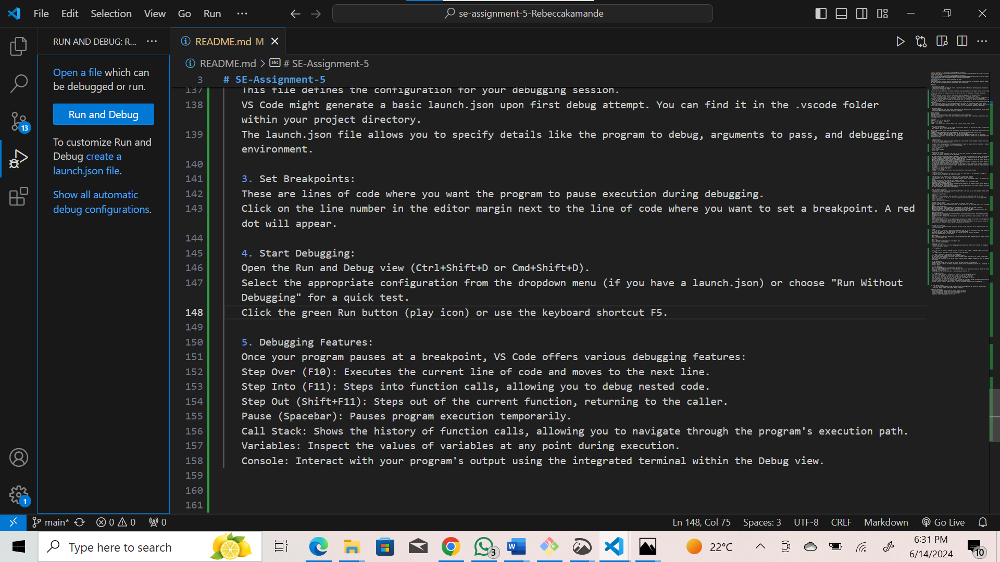
   Select the appropriate configuration from the dropdown menu (if you have a launch.json) or choose "Run Without Debugging" for a quick test.
   Click the green Run button (play icon) or use the keyboard shortcut F5.

   5. Debugging Features:
   Once your program pauses at a breakpoint, VS Code offers various debugging features:
   Step Over (F10): Executes the current line of code and moves to the next line.
   Step Into (F11): Steps into function calls, allowing you to debug nested code.
   Step Out (Shift+F11): Steps out of the current function, returning to the caller.
   Pause (Spacebar): Pauses program execution temporarily.
   Call Stack: Shows the history of function calls, allowing you to navigate through the program's execution path.
   Variables: Inspect the values of variables at any point during execution.
   Console: Interact with your program's output using the integrated terminal within the Debug view.

10. Using Source Control:
    - How can users integrate Git with VS Code for version control? Describe the process of initializing a repository, making commits, and pushing changes to GitHub.

    1. Initialising: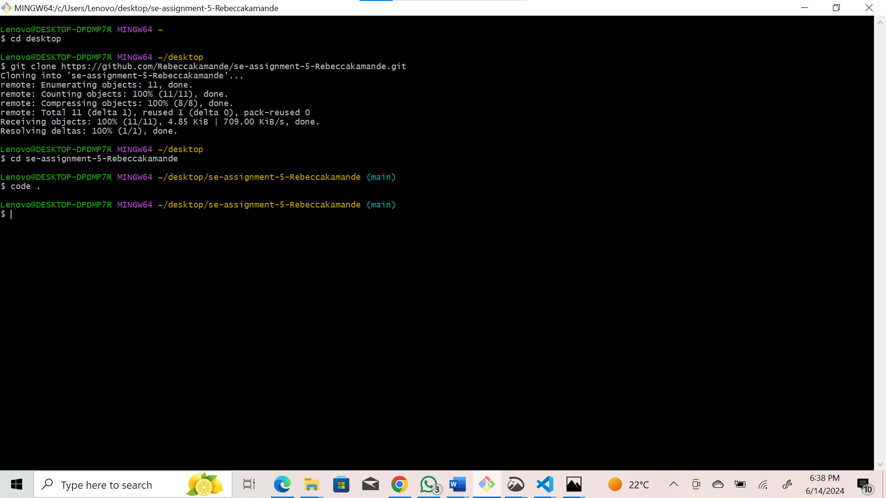
    open Git bash and clone the repositoty from your Github account.
    Use "code . " to open the repository in VS code.

    2. Making Commits: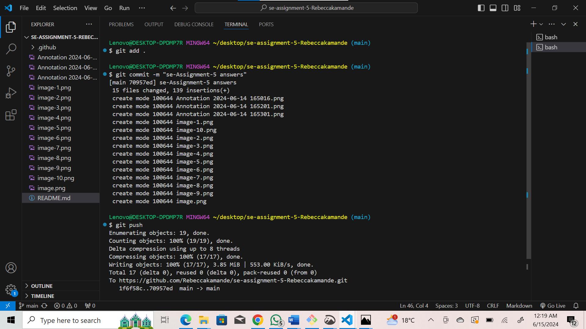

    Finally, commit your staged changes with a clear message using the blue "Commit" button in the source control view or by running the "Git: Commit" command from the Command Palette.

    3. Pushing Changes to GitHub (Remote Repository):git
    The first time you push, you might need to configure your Git credentials within VS Code for authentication.
    Once configured, VS Code will establish a connection with GitHub and push your local commits to the remote repository.

 Submission Guidelines:
- Your answers should be well-structured, concise, and to the point.
- Provide screenshots or step-by-step instructions where applicable.
- Cite any references or sources you use in your answers.
- Submit your completed assignment by 1st July 

